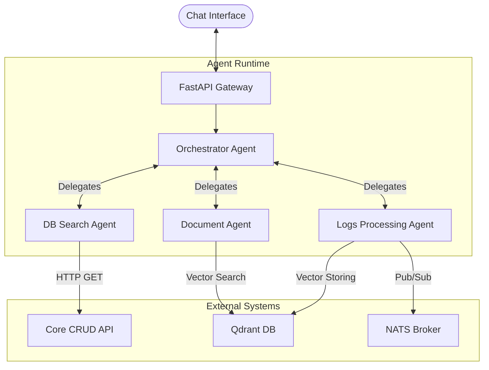
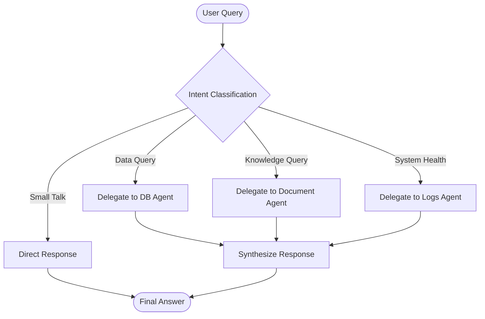
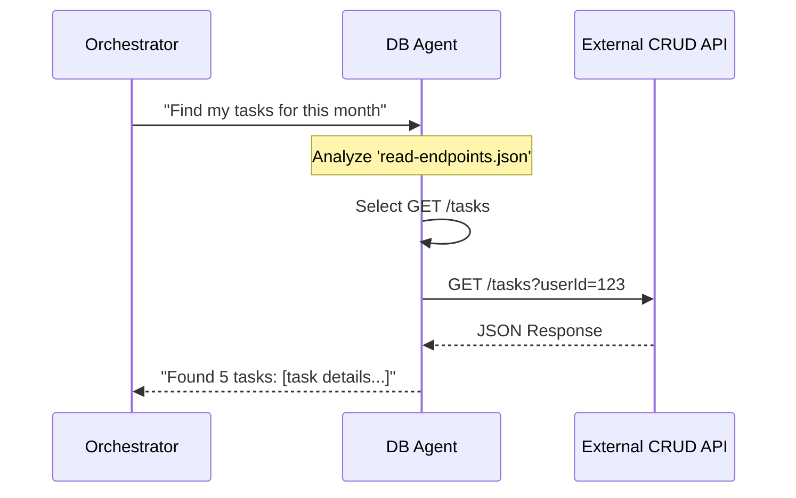
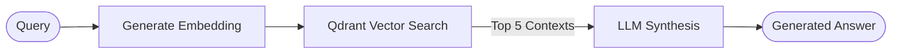
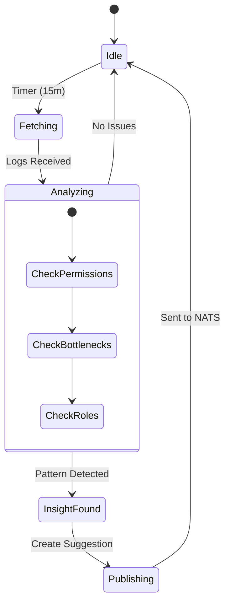
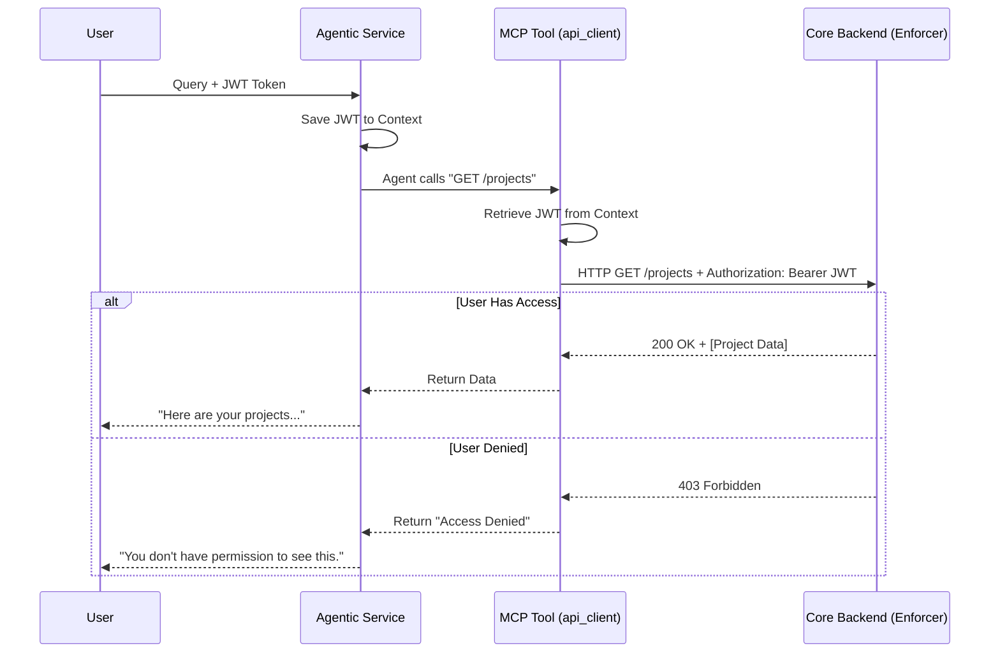

# Gony Agentic System Design

## 1. High-Level Architecture

The Gony Agentic System acts as an intelligent layer on top of the Gony microservices ecosystem. It is designed to be **stateless logic** (agents) with **persistent memory** (Qdrant & Cassandra) and **event-driven communication** (NATS).

### Core Components

1.  **FastAPI Gateway**: The entry point for REST interactions (Chat UI).
2.  **Orchestrator (The Brain)**: A central router that decomposes user intent.
3.  **Specialist Agents (The Limbs)**: Autonomous units with specific tools and domain knowledge.
4.  **Vector Memory (The Hippocampus)**: Qdrant stores semantic knowledge (docs, logs insights).
5.  **Event Bus (The Nervous System)**: NATS handles asynchronous tasks (logs) and real-time notifications.

---

## 2. Agent Architecture

Each agent is built on the **Agno Framework** (formerly Phidata) and follows a standardized internal architecture.

### 2.1. The Orchestrator Agent
*   **Role**: Controller & Synthesizer.
*   **Input**: User query + History.
*   **Logic**: Decides whether to answer directly (small talk) or delegate to a specialist.

### 2.2. DB Search Agent
*   **Role**: Structured Data Retrieval.
*   **Logic**: Maps vague questions to specific CRUD API endpoints.

### 2.3. Document Agent
*   **Role**: Unstructured Knowledge (RAG).
*   **Pipeline**: Embed -> Search -> Synthesize.

### 2.4. Logs Processing Agent (Autonomous)
*   **Role**: Deep Analysis of System Logs.
*   **Trigger**: Periodic Background Task.

---

## 3. Data Flow & Lifecycles

### 3.1. Request Lifecycle (Chat)
1.  **Auth Layer**: `HTTPBearer` validates JWT.
2.  **Context Injection**: Token, WorkspaceID, and Role are saved to thread-local contexts.
3.  **Agent Execution**:
    *   Orchestrator receives query.
    *   Calls Sub-Agent (e.g., DB Agent).
    *   Sub-Agent executing Tool (e.g., `call_crud_endpoint`).
    *   Tool reads thread-local storage to inject `Authorization` header.
    *   External API returns data.
4.  **Response**:
    *   Agent generates text.
    *   **Side Effect 1**: Text published to NATS (`user.{id}.inbox`).
    *   **Side Effect 2**: Audit Log published to (`logs.trace`).
    *   HTTP Response returned to user.

### 3.2. Background Analysis Lifecycle
1.  **Timer**: `run_periodic_log_analysis` wakes up.
2.  **Fetch**: NATS Request (`logs.retrieve`) -> NATS Broker -> Logging Service -> NATS Reply.
3.  **Analysis**: LLM processes 50+ logs in batch.
4.  **Action**:
    *   If insight found: Formats `Suggestion`.
    *   Identifies target users.
    *   Publishes to `user.{id}.inbox`.

---

## 4. Security & Access Control

The system implements a **Zero-Trust Access Control** model where the Agentic System itself does *not* possess super-admin privileges. Instead, it impersonates the user who initiated the request.

### How it Works (The "Identity Propagation" Flow)

1.  **User Identity**:
    *   When a user sends a request to `POST /query`, they header `Authorization: Bearer <JWT>`.
    *   The **FastAPI Gateway** validates this token signature but *does not decode permissions* itself.

2.  **Context Storage**:
    *   The raw JWT string is saved into a **Thread-Local Context** (`app.core.context.auth_token_context`).
    *   This makes the token available globally to any function running within that specific request thread, without passing it as a variable 20 levels deep.

3.  **LLM Reasoning (The "Plan")**:
    *   The **DB Search Agent** decides it needs data (e.g., "I need to call `GET /projects`").
    *   It uses the `read-endpoints.json` context to know *how* to construct the URL, but it has no "keys" to access it yet.

4.  **Tool Execution (The "Action")**:
    *   The agent calls the python tool `call_crud_endpoint(url="/projects")`.
    *   Inside this tool, the code retrieves the JWT from the thread-local context.
    *   It injects it into the outbound HTTP request header: `Authorization: Bearer <JWT>`.

5.  **External Enforcement**:
    *   The **Core Backend API** receives the request.
    *   **It** validates the token, checks the user's role (e.g., "Viewer" vs "Admin"), and applies Row-Level Security (RLS).
    *   If the user has access: Takes data and returns `200 OK`.
    *   If the user does **not** have access: Returns `403 Forbidden`.

6.  **Agent Handling**:
    *   The Agent receives the `403` error.
    *   **Crucially**: The agent is instructed (via prompt) to explain this to the user: *"I checked, but you don't have the required permissions to view the projects."*
    *   It cannot "bypass" this limit because it never had a master key—it only had the user's key.

---

## 5. Key Design Decisions

1.  **Externalized Configuration**:
    *   We use strict Pydantic models in `config.py` that **require** environment variables (no hardcoded defaults).
    *   Allows seamless switching between Models (Gemini <-> Claude) and Environments (Dev <-> Prod).

2.  **Stateless API + Stateful Memory**:
    *   The API container is stateless (can scale horizontally).
    *   State is offloaded to:
        *   **Cassandra**: Chat History (fast writes, time-series).
        *   **Qdrant**: Semantic Memory (fast retrieval).
        *   **PostgreSQL**: Business Data (via CRUD API).

3.  **Security by Design**:
    *   **Token Propagation**: The agent never "stores" credentials; it forwards the user's ephemeral token for every request.
    *   **Read-Only Context**: DB Search Agent is only given GET endpoints to prevent accidental data mutation.
