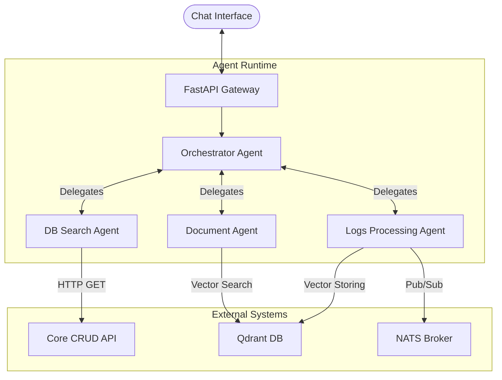
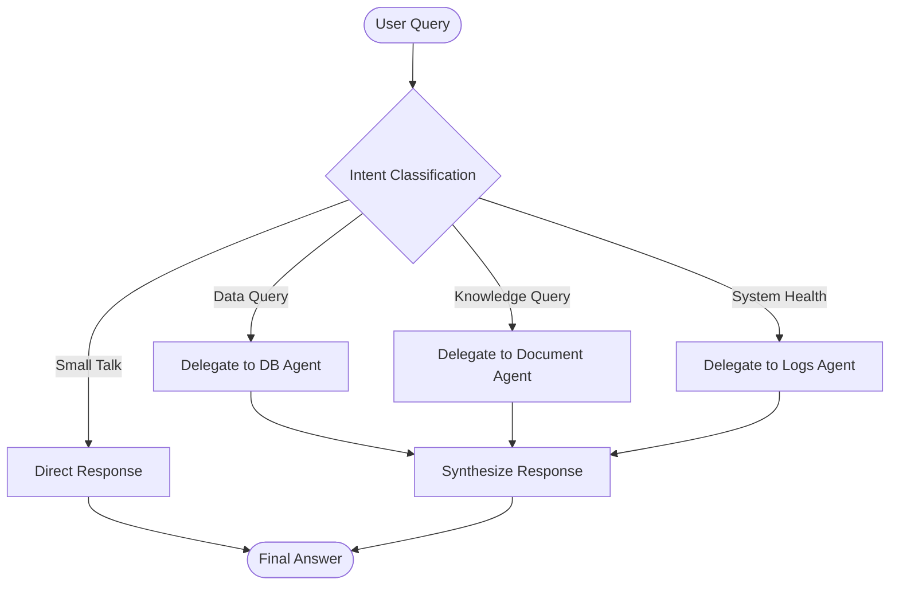
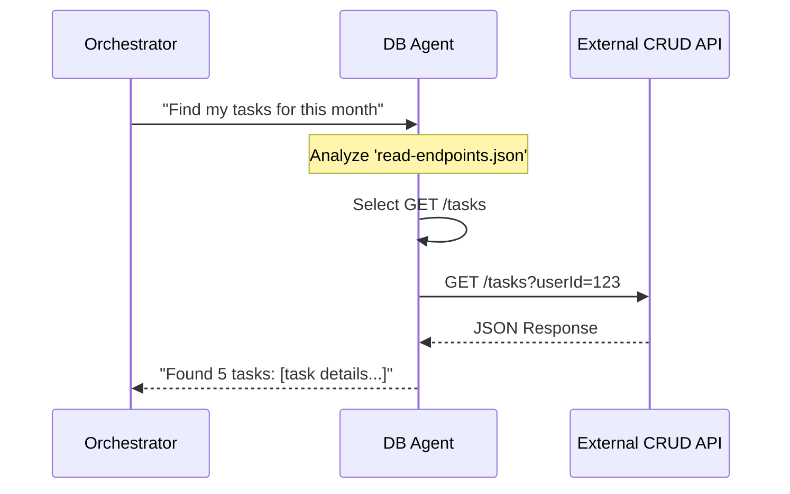
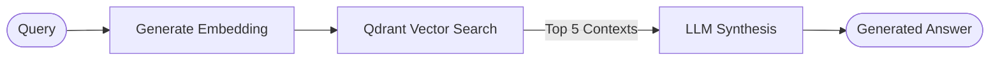
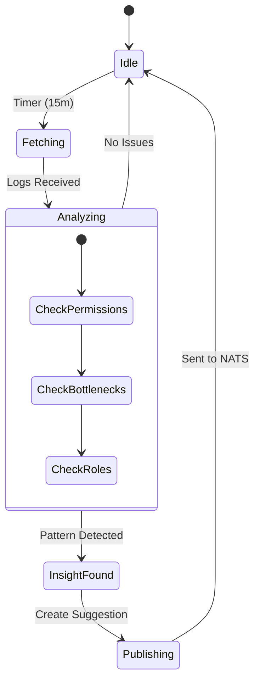
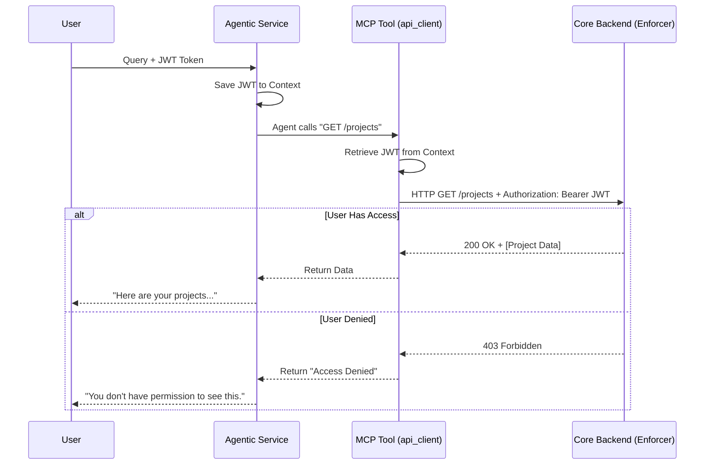

# Gony Agentic Service

The **Gony Agentic Service** is an intelligent, multi-agent system designed to act as a virtual colleague within the Gony workspace. It leverages **Agentic RAG (Retrieval-Augmented Generation)**, **SQL/CRUD capabilities**, and **autonomous log analysis** to assist users, automate workflows, and monitor system health.

Built with **FastAPI**, **Agno (Phidata)**, **Qdrant**, and **NATS**, it integrates seamlessly with the Gony ecosystem.

---

## 🏗️ System Architecture

The system follows a **Hub-and-Spoke** agentic architecture where a central **Orchestrator** delegates tasks to specialized sub-agents. It interacts with the outside world via REST APIs (for user chat) and NATS (for event-driven logs and notifications).



---

## 🤖 Agents & Roles

### 1. Orchestrator Agent (The "Team Leader")
*   **Role**: Virtual Colleague & Project Manager.
*   **Responsibility**: The user-facing interface. It receives natural language queries, understands intent, delegates work to the specialist agents, and synthesizes the final friendly response.
*   **Persona**: Warm, professional, non-technical. Handles errors gracefully (e.g., interprets "404 Not Found" as "Free Schedule").

**Logic Flow**:


### 2. DB Search Agent (The "Data Specialist")
*   **Role**: Database & API Specialist.
*   **Responsibility**: Fetching structured data (Projects, Tasks, Users, Workflows) from the Core Backend.
*   **Tools**:
    *   `list_tables()`: Explore available data structures.
    *   `call_crud_endpoint(method, url)`: Execute GET requests against the `CRUD_API_URL` to retrieve live data.
*   **Knowledge**: Has access to `crud-endpoints.json` context to map user questions to specific API endpoints.

**Sequence**:


### 3. Document Agent (The "Librarian")
*   **Role**: Knowledge Base Specialist (RAG).
*   **Responsibility**: Answering questions based on unstructured documents (PDFs, Wikis, Guidelines) stored in the Vector Database.
*   **Tools**:
    *   `fetch_document_content(url)`: Retrieves the full text of a document found via search.
*   **Knowledge**: Connected to **Qdrant** (`documents` collection) to perform semantic search on company knowledge.

**Pipeline**:


### 4. Logs Processing Agent (The "System Analyst")
*   **Role**: Autonomous Log Analyst & Consultant.
*   **Responsibility**: Runs in the background (periodically) to monitor system health, detect inefficiencies, and suggest improvements.
*   **Tools**:
    *   `fetch_logs(limit, filter)`: Retrieves recent system logs via NATS.
    *   `publish_suggestion(json)`: Broadcasts actionable insights to users or the system via NATS channels.
*   **Workflow**:
    1.  Fetches recent logs.
    2.  Analyzes for **Resource Access** (permissions), **Action Patterns** (manual bottlenecks), and **Role Issues**.
    3.  Generates a "Proposal" or "Message".
    4.  Publishes it to `user.{id}.inbox` via NATS.

**Autonomous Loop**:


---

## 🔐 Security & Access Control

The system implements a **Zero-Trust Access Control** model where the Agentic System itself does *not* possess super-admin privileges. Instead, it impersonates the user who initiated the request.

### Identity Propagation Flow

1.  **User Identity**:
    *   When a user sends a request to `POST /query`, they header `Authorization: Bearer <JWT>`.
    *   The **FastAPI Gateway** validates this token signature but *does not decode permissions* itself.

2.  **Context Storage**:
    *   The raw JWT string is saved into a **Thread-Local Context** (`app.core.context.auth_token_context`).
    *   This makes the token available globally to any function running within that specific request thread.

3.  **LLM Reasoning (The "Plan")**:
    *   The **DB Search Agent** decides it needs data (e.g., "I need to call `GET /projects`").
    *   It uses the `read-endpoints.json` context to know *how* to construct the URL, but it has no "keys" to access it yet.

4.  **Tool Execution (The "Action")**:
    *   The agent calls the python tool `call_crud_endpoint(url="/projects")`.
    *   Inside this tool, the code retrieves the JWT from the thread-local context.
    *   It injects it into the outbound HTTP request header: `Authorization: Bearer <JWT>`.

5.  **External Enforcement**:
    *   The **Core Backend API** receives the request.
    *   **It** validates the token, checks the user's role, and applies Row-Level Security (RLS).
    *   If the user has access: Returns `200 OK`.
    *   If the user does **not** have access: Returns `403 Forbidden`.

6.  **Agent Handling**:
    *   The Agent receives the `403` error and is instructed to explain this to the user: *"I checked, but you don't have the required permissions to view the projects."*



---

## 🔄 Lifecycle Data Flow

### Request Lifecycle (Chat)
1.  **Auth Layer**: `HTTPBearer` validates JWT.
2.  **Context Injection**: Token, WorkspaceID, and Role are saved.
3.  **Agent Execution**:
    *   Orchestrator receives query.
    *   Calls Sub-Agent (e.g., DB Agent).
    *   Sub-Agent executing Tool.
    *   Tool injects `Authorization` header.
    *   External API returns data.
4.  **Response**:
    *   Agent generates text.
    *   **Side Effect**: Text published to NATS (`user.{id}.inbox`).
    *   **Side Effect**: Audit Log published to (`logs.trace`).
    *   HTTP Response returned to user.

---

## 🛠️ Technology Stack

*   **Framework**: Python 3.12, FastAPI
*   **LLM Orchestration**: [Agno (formerly Phidata)](https://github.com/agno-agi/agno)
*   **LLM Provider**: Anthropic Claude (via `agno.models.anthropic`)
*   **Vector Database**: Qdrant (for RAG and Memory)
*   **Messaging**: NATS (for async logs and event-driven communication)
*   **Database**: PostgreSQL (via internal CRUD API), Cassandra (for Chat History)

## ⚙️ Configuration

The service is configured via environment variables (loaded from `.env`).

| Variable | Description |
| :--- | :--- |
| `ANTHROPIC_API_KEY` | Key for Claude models. |
| `CRUD_API_URL` | Base URL for the external Core Backend (e.g., `http://host.docker.internal:8080`). |
| `NATS_URL` | URL for NATS broker. |
| `QDRANT_HOST` | Hostname for Vector DB. |

---

## 🚀 Getting Started

1.  **Environment Setup**:
    ```bash
    cp .env.example .env
    # Fill in ANTHROPIC_API_KEY and CRUD_API_URL
    ```

2.  **Run with Docker**:
    ```bash
    docker-compose up --build
    ```

3.  **Access**:
    *   API Docs: `http://localhost:8001/docs`
    *   Agent Query: `POST /api/v1/agent/query`
